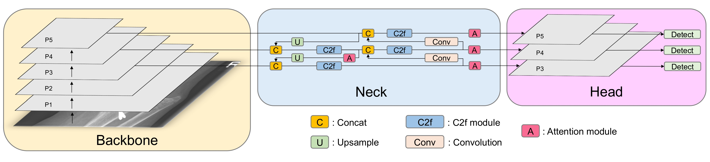
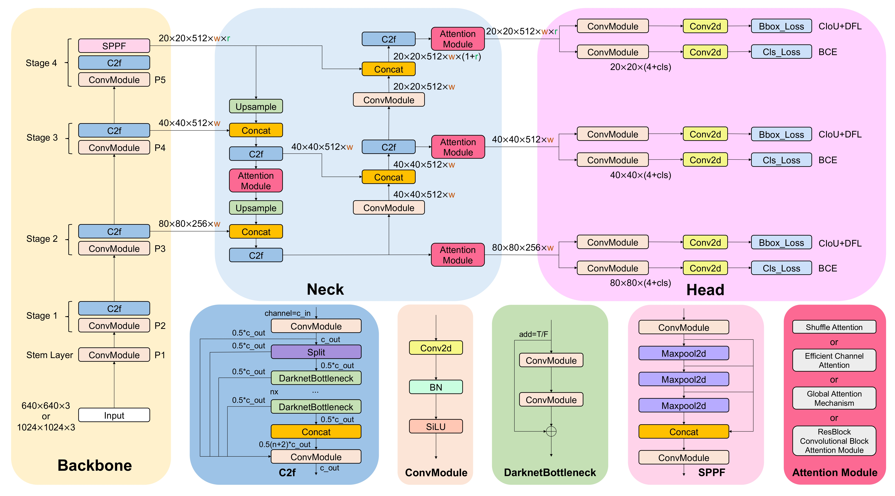

# PCBGuard-AI-Powered-PCB-Defect-Detection-and-Analysis

This repository contains the code and resources for a PCB defect detection project. The project uses YOLO and other comparative models to detect and classify PCB defects, along with improvements to the dataset for achieving better results.

## Defects Detected
The following PCB defects are identified by the models:

- **Mouse Bite**
- **Spur**
- **Missing Hole**
- **Short**
- **Open Circuit**
- **Spurious Copper**

## Table of Contents

- [Overview](#overview)
- [Dataset](#dataset)
- [Models](#models)
- [Results](#results)
- [Usage](#usage)
- [Future Work](#future-work)
- [Contributing](#contributing)
- [License](#license)

## Overview

The goal of this project is to develop an efficient and accurate system for detecting defects in PCBs (Printed Circuit Boards). The project includes:

- Implementation of YOLO (You Only Look Once) for real-time object detection.
- Comparative analysis of other deep learning models.
- Dataset augmentation and preprocessing for improved performance.

## Dataset

The dataset used in this project has been carefully curated and improved to achieve better detection results. It includes labeled images of PCBs with the following defect categories:

| Defect Name       | Label ID |
|-------------------|----------|
| Mouse Bite        | 0        |
| Spur              | 1        |
| Missing Hole      | 2        |
| Short             | 3        |
| Open Circuit      | 4        |
| Spurious Copper   | 5        |

### Improvements Made to the Dataset:

- Data augmentation techniques such as rotation, flipping, and scaling.
- Cleaning mislabeled or noisy data.
- Adding more diverse samples to handle edge cases.

## Models

### YOLO
- Implemented using [YOLOv5](https://github.com/ultralytics/yolov5) and [YOLOv8](https://github.com/ultralytics/ultralytics).
- Fine-tuned for PCB defect detection.

### Customizing YOLOv8 for PCB Defect Detection



### Detail of Architecture

#### Modifying the YOLOv8 Head

1. Install the YOLOv8 repository from Ultralytics:
   ```bash
   pip install ultralytics
   ```

2. Customize the YOLOv8 model head to match the number of classes (6 for PCB defects):

   ```python
   from ultralytics import YOLO

   # Load YOLOv8 model
   model = YOLO('yolov8s.yaml')  # Use YOLOv8 small model as base

   # Modify the model head for 6 classes (PCB defect classes)
   model.model.head = model.model.head.__class__(
       ch=model.model.head.in_channels,  # Input channels from backbone
       nc=6  # Number of classes in your dataset
   )

   # Train the model
   model.train(data='pcb_dataset.yaml', epochs=50, imgsz=640, project='pcb_defect_detection', name='yolov8_custom')
   ```

#### Training Command
To train the model on your dataset:
```bash
python train.py model=yolov8s.yaml data=pcb_dataset.yaml epochs=50 imgsz=640
```

#### Dataset Configuration
Update your `pcb_dataset.yaml` file:
```yaml
# pcb_dataset.yaml
train: path/to/train/images
val: path/to/val/images

nc: 6
names: ["mouse_bite", "spur", "missing_hole", "short", "open_circuit", "spurious_copper"]
```

#### Evaluate Model Performance
After training, evaluate the performance:
```bash
python val.py model=pcb_defect_detection/yolov8_custom/weights/best.pt data=pcb_dataset.yaml
```

### Comparative Models
- [ResNet](https://arxiv.org/abs/1512.03385)
- [EfficientNet](https://arxiv.org/abs/1905.11946)
- [Faster R-CNN](https://arxiv.org/abs/1506.01497)

Performance comparisons have been conducted to evaluate precision, recall, and F1-score.

## Results

The following table summarizes the performance metrics for the best-performing models:

| Model           | Precision | Recall | F1-Score |
|-----------------|-----------|--------|----------|
| YOLOv8          | 0.94      | 0.92   | 0.93     |
| YOLOv5          | 0.92      | 0.90   | 0.91     |
| Faster R-CNN    | 0.88      | 0.85   | 0.86     |
| EfficientNet    | 0.85      | 0.83   | 0.84     |


## Usage

### Installation

1. Clone this repository:
   ```bash
   git clone https://github.com/Dr-irshad/PCBGuard-AI-Powered-PCB-Defect-Detection-and-Analysis.git
   cd pcb-defect-detection
   ```

2. Install the required dependencies:
   ```bash
   pip install -r requirements.txt
   ```

### Training

To train the YOLO model on your dataset:
```bash
python train.py --data config.yaml --weights yolov5s.pt --epochs 50
```

To train YOLOv8:
```bash
python train.py model=yolov8s.yaml data=pcb_dataset.yaml epochs=50 imgsz=640
```

### Inference

To perform inference on test images:
```bash
python detect.py --weights best.pt --source test_images/
```

### Evaluation

To evaluate the model:
```bash
python evaluate.py --weights best.pt --data config.yaml
```

## Future Work

- Further enhancement of dataset quality and diversity.
- Implementation of additional state-of-the-art models.
- Deployment of the best-performing model in an industrial setting.

## Contributing

Contributions are welcome! Please follow these steps:

1. Fork the repository.
2. Create a feature branch (`git checkout -b feature-name`).
3. Commit your changes (`git commit -m 'Add feature'`).
4. Push to the branch (`git push origin feature-name`).
5. Create a pull request.

## License

This project is licensed under the MIT License. See the [LICENSE](LICENSE) file for details.

---

Feel free to open an issue for questions, suggestions, or any assistance.
